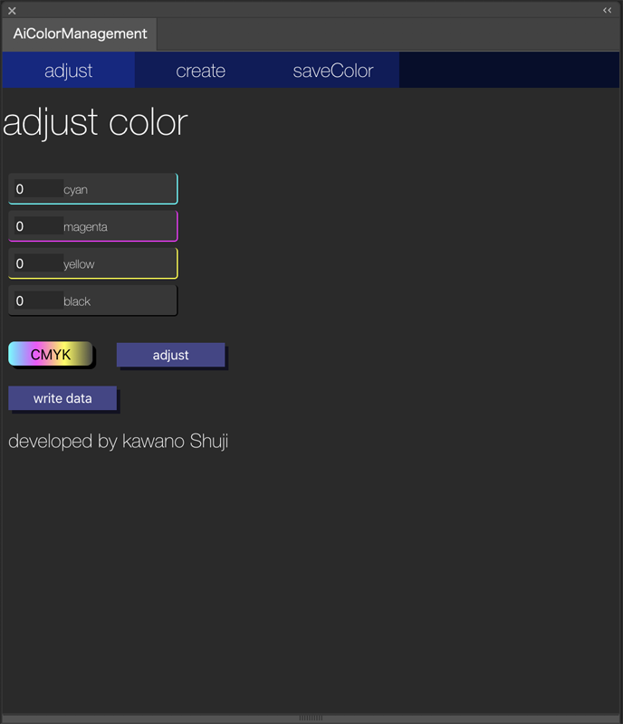
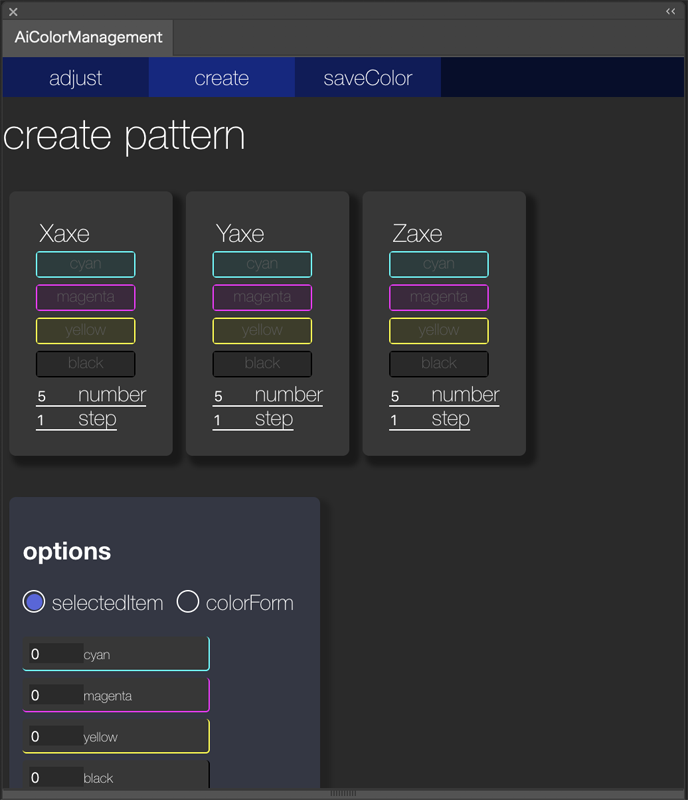
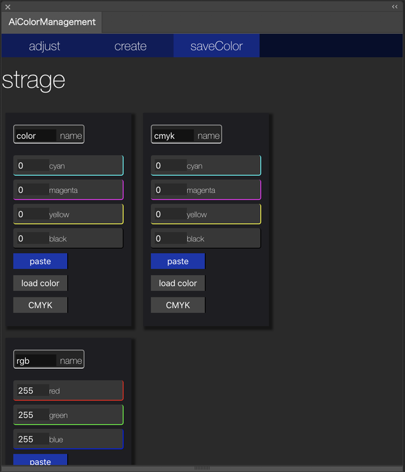

<h1>Ai ColorManagement</h1>

<h2>this is the Illustrator Extension for management colors</h2>

it managements and control path color on Illustrator.
personally I choose functions and developed on the panel.
like adjust color selected on Illustrator or create color patterns just click the button.
and save color data temporary

adjust color you selected. select number how much you adjust each colors.
click adjust button , selected path items color will be changed

it creates color patterns. you select colors for each axe. and how much you'd like patterns and how steps color number you prefer. on option form, you can select origin point of color whether it comes from selected path item or you make from form

it saves color data temporary. and also you can paste saved color. click load color , it load color from defaultFillColor. sharing color data beyond documents , I thought it really draged me so I developed it

<h3>write data</h3>

you'll find write data button on any color mode. it write color data on path item. it makes visible specific color data on document

<h3>download</h3>

below the link

<a href="http://kawano-shuji.com/strage/AiColorManagementC_X2.zxp">Extension AiColorManagement</a>

before install you need extension Anastasiy’s Extension Manager

<a href="https://install.anastasiy.com/">Anastasiy’s Extension Manager</a>

<a href="https://kawano-shuji.com/justdiary/2020/10/24/extension-aicolormanagement/">Japanese explanation here</a>
