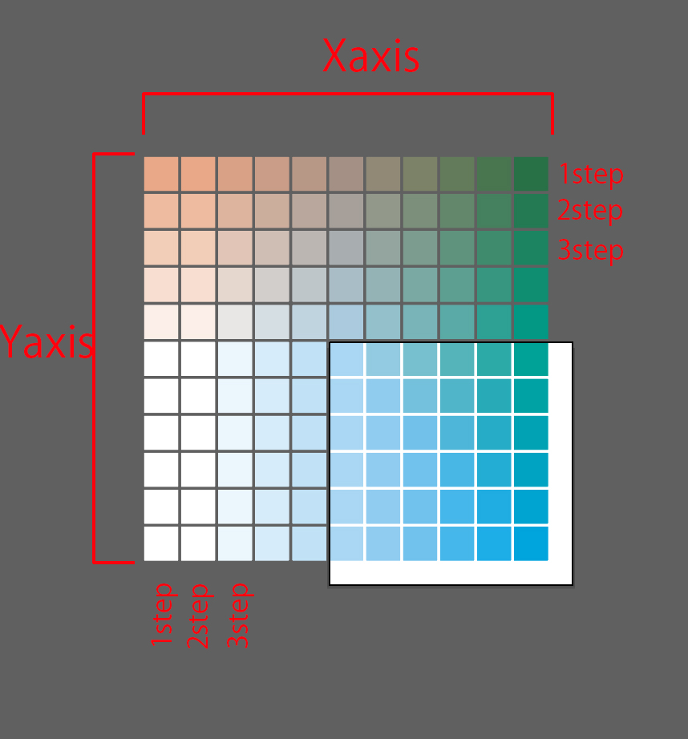

# Illustrator Extension ColorManagement 

making color pattern , replacing color's 
hoping more efficient to do
the Extension generates color pattern automatically and replaces colors easily
I developed these features on the panel.

[Japanese explanation is here](https://kawano-shuji.com/justdiary/2021/11/10/illustrator%e7%94%a8extension-aicolormanagement-ver3/)

## Adjust

adjusting color youselected
filling in form and choose color mode
and it adjusts colors all of you selected

1. **Additional**  
it adds value of color  
fill in color value form , and click the adjust button , it adds color value on path items

2. **AddRatio**  
it adds percentage of value of color  
additional is literally adds value but this adds percentage of value of color

3. **Saturation**  
adjusting saturation  
in case of saturation and brightness , fill in form of amount not the color form.
and also in case of CMYK , you can select it the adjustment includes black color or not

4. **Brightness**  
adjusting brightness
it adjust brightness of color.

## Create

createing color patterns following Axis form's parameter.

each Axis has color button , step , number form. it follows these form.
like if you want to create cyan color pattern on Y axis , you check yellow button on Y axis and
it creates yellow color patttern of items. number form is how many color pattern you want to make.
step is how adding value of color. fill in higer value , it adds more value of color per item.    
selected and colorForm checkboxes are origin point of pattern. selected is create pattern from item you select as a origin point of pattern. colorForm is create pattern from value of form as a origin point.  
checking "as a center" checkbox , create added value pattern and subtracted value pattern.

## Replace
it replaces color . select items you want to replace , and fill in color form , it replaces colors you filled in form.

## Strage
it saves color data temporary  
in some case , you might think want to keep value of color , but registering spot color or put path item beside art board is inconvenience.  
such a case , it usufull .
not only fill in form , load color from path item , and it export color data as a path item as well.

other than that , strage color can be filled in form and use in other mode.

## other write color data
write key , flat button can write color data as a text on you selected item

  
**[hope to download zxp? here](https://kawano-shuji.com/strage/AiColorManagement_ver3.zxp)**